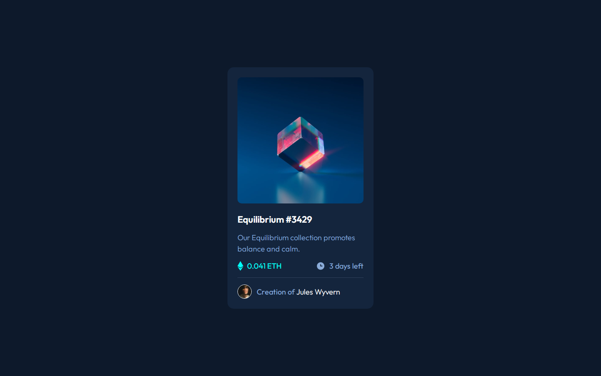

# Frontend Mentor - NFT preview card component solution

This is a solution to the [NFT preview card component challenge on Frontend Mentor](https://www.frontendmentor.io/challenges/nft-preview-card-component-SbdUL_w0U). Frontend Mentor challenges help you improve your coding skills by building realistic projects.

## Table of contents

- [Overview](#overview)
  - [The challenge](#the-challenge)
  - [Screenshot](#screenshot)
  - [Links](#links)
- [My process](#my-process)
  - [Built with](#built-with)
  - [What I learned](#what-i-learned)
  - [Continued development](#continued-development)
- [Author](#author)

## Overview

### The challenge

Users should be able to:

- View the optimal layout depending on their device's screen size
- See hover states for interactive elements

### Screenshot



### Links

- Solution URL: [Solution URL](https://github.com/rudimediaz/fem-nft-preview-card)
- Live Site URL: [Live Site URL](https://rudhifemnftcard.netlify.app/)

## My process

### Built with

- Semantic HTML5 markup
- CSS custom properties
- Flexbox
- Mobile-first workflow
- Vite - bundler

### What I learned

I learned about layering image when user hover at them.

#### HTML structure

```html
<div class="card__visual item-image">
  
  <div class="item-image__overlay item-image-overlay">
    
  </div>
</div>
```

#### The Stylesheet

Using _:before_ to layer background below view icon. And give it a little bit of transition.

```css
.item-image {
  display: flex;
  flex-direction: column;
  border-radius: 10px;
  overflow-x: hidden;
  position: relative;
}

.item-image:hover {
  cursor: pointer;
}

.item-image:hover::before {
  opacity: 0.5;
  transform: scale(1, 1);
}

/* animate them  */
.item-image::before,
.item-image .item-image__overlay {
  transition: all 0.7s cubic-bezier(0.97, 0.07, 0.05, 1) 0.2s;
}

.item-image:hover > * {
  opacity: 1;
}

.item-image::before {
  position: absolute;
  inset: 0;
  width: 100%;
  height: 100%;
  content: "";
  background-color: var(--cyan-1);
  opacity: 0;
  transform: scale(0, 0);
}

.item-image > img {
  height: 100%;
  width: 100%;
}

.item-image .item-image__overlay {
  position: absolute;
  width: 100%;
  height: 100%;
  inset: 0;
}

.item-image-overlay {
  display: grid;
  place-items: center;
  opacity: 0;
}
```

### Continued development

I reverse engineered the design images in figma (because i'm non pro subcriber), and i found the mismatch between _style-guide_ and the result. So, it confused me to decide which one i follow, my judgement or the style guide. In style guide, it says 18px for the font size of body copy. But, in many trials and attempt it supposed to be around 17px or something. I wish there are some insights to refine the Typography of this challenge.

## Author

- Website - WIP
- Frontend Mentor - [@rudimediaz](https://www.frontendmentor.io/profile/rudimediaz)
- Twitter - [@rudimediaz](https://www.twitter.com/rudimediaz)
